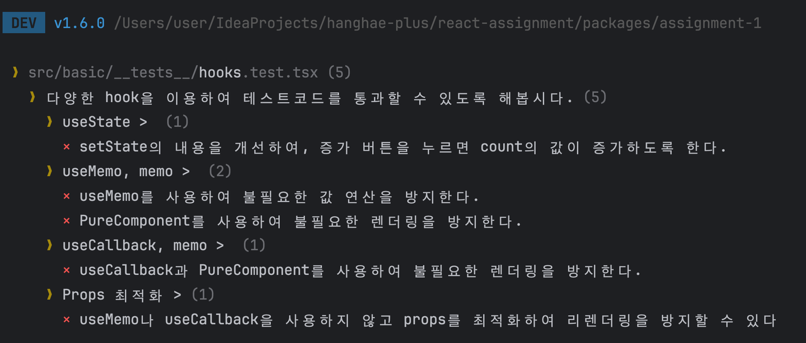
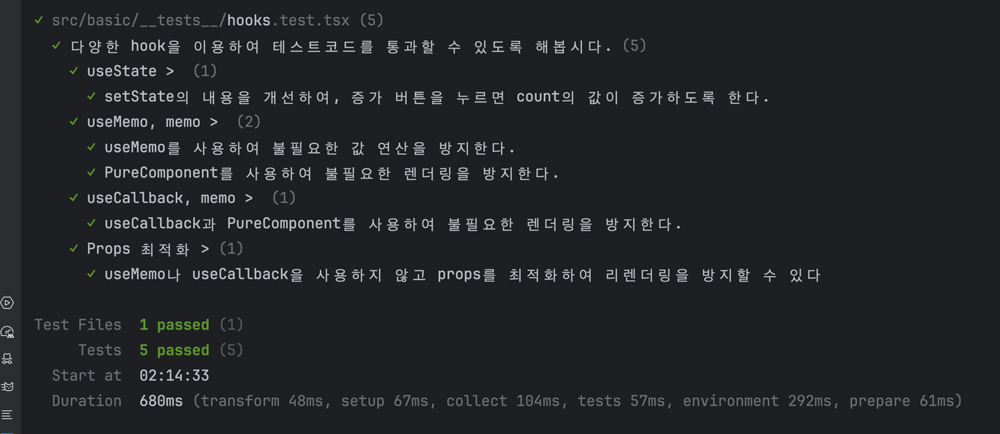
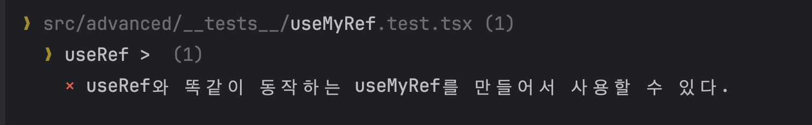
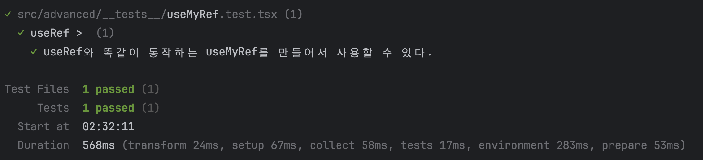

# React를 잘 사용해보자.

## 시도해볼 것

- [x] useState 사용해보기 -> 불변성에 대해 판단하기
- [x] useMemo 사용해보기 -> 리렌더링
- [x] useCallback 사용해보기 -> 리렌더링
- [x] useState로 useRef 만들어보기
- [x] props를 사용해보기

1. `pnpm -F assignment-1 test:basic` 를 실행하면 테스트를 실행할 수 있습니다.
2. 처음에는 테스트 코드가 모두 실패할 것입니다.

# Basic 목표

다음 파일의 일부 내용을 수정하여 테스트 코드가 통과하도록 만들어주세요

1. UseStateTest.tsx
2. UseMemoTest.tsx
3. PureComponentTest.tsx
4. UseCallbackTest.tsx
5. RequireRefactoring.tsx

# Advanced 목표

- useRef는 항상 동일한 메모리에 있는 ref를 반환합니다.
- 현재 테스트 코드에 있는 useMyRef 실행하면 항상 다른 메모리에 있는 ref를 반환합니다.
- useMyRef도 useRef처럼 항상 동일한 메모리에 있는 ref를 반환하도록 해주세요.
  - **전역 공간에다가 선언하면 안 됩니다**
