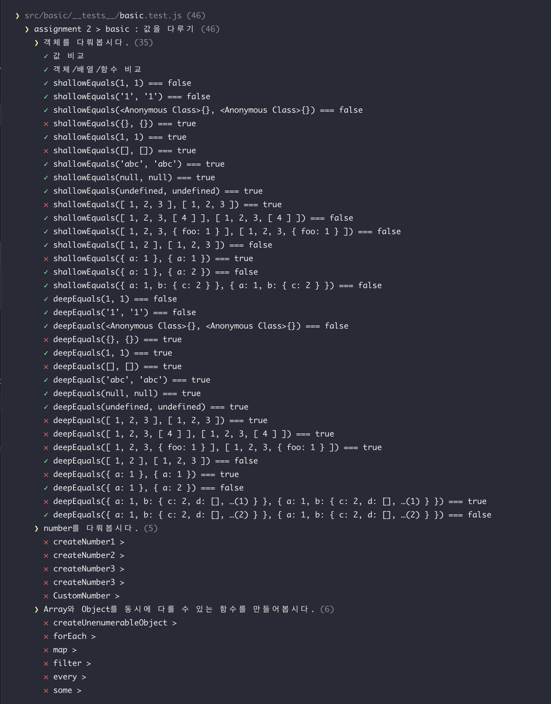
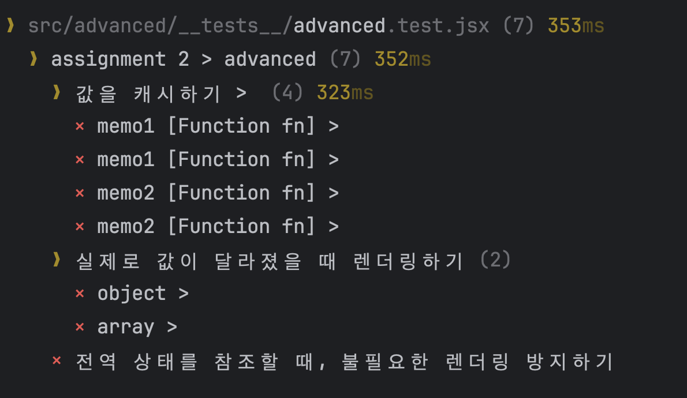
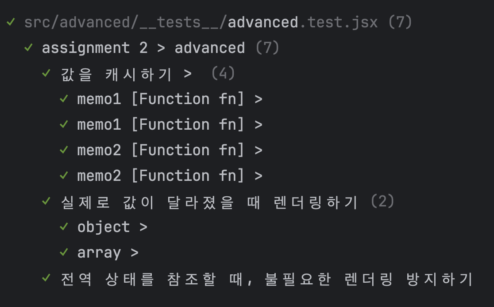

# React를 잘 사용해보자.

## 시도해볼 것

## Basic 목표

1. `pnpm -F assignment-2 test:basic` 를 실행하면 테스트를 실행할 수 있습니다.
2. 처음에는 일부 테스트 코드가 실패할 것입니다.

src/basic/basic.js의 내용을 수정하여 테스트 코드가 통과되도록 해주세요.

## Advanced 목표

1. `pnpm -F assignment-2 test:advanced` 를 실행하면 테스트를 실행할 수 있습니다.
2. 처음에는 테스트 코드가 모두 실패할 것입니다.

`packages/assignment-2/src/advanced/advanced.jsx` 의 내용을 수정하여 테스트 코드가 모두 통과되도록 만들어주세요.
