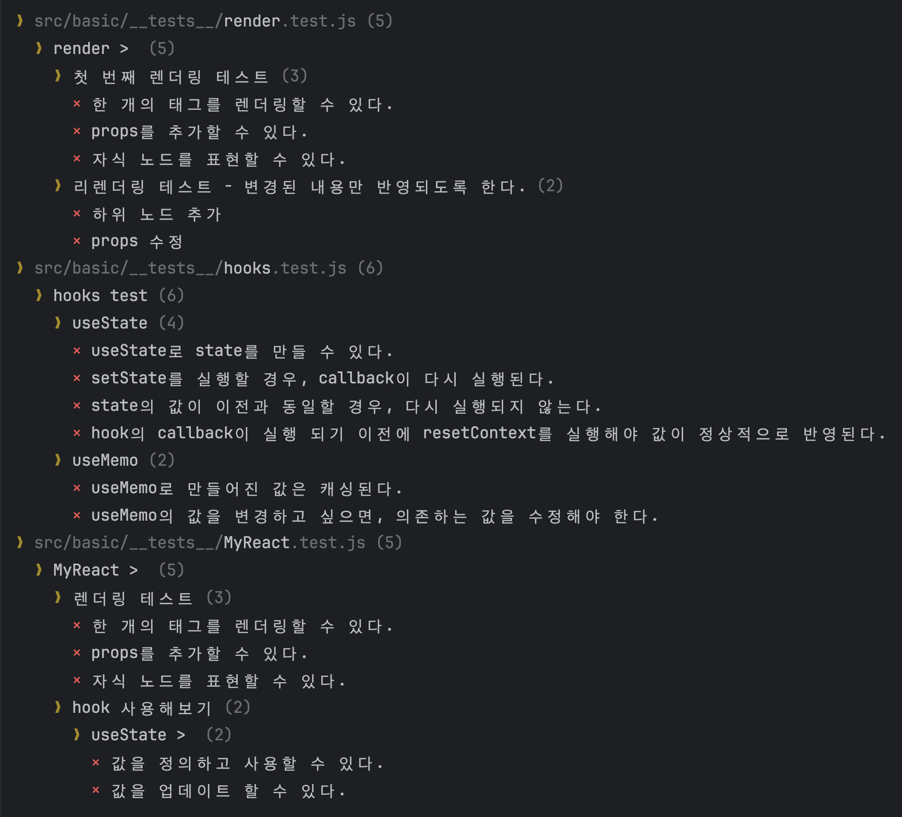
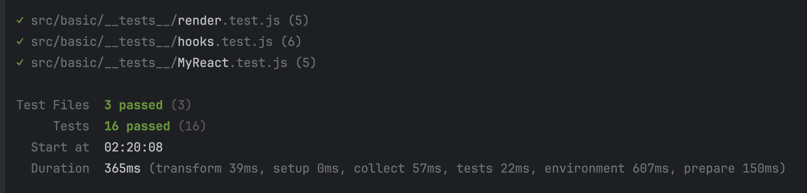
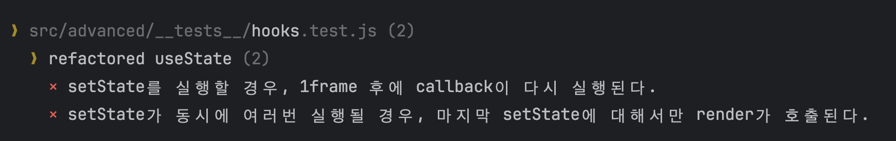
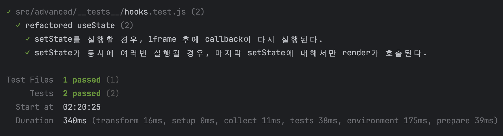

# React를 직접 구현해보자

## 시도해볼 것

## Basic 목표

1. `pnpm -F assignment-3 test:basic` 를 실행하면 테스트를 실행할 수 있습니다.
2. 처음에는 테스트 코드가 모두 실패할 것입니다.

src/basic/basic.js의 내용을 수정하여 테스트 코드가 통과되도록 해주세요.

### (1) render.js

`packages/assignment-3/src/basic/render.js`의 코드를 수정하여 `render.test.js`의 테스트를 실행 했을 때 모두 통과(PASS)하도록 만들어주세요.

1. jsx 함수를 구현합니다. (dom 구조와 비슷한 객체를 만들어서 사용하기 위함)

1. createElement 함수를 구현합니다. (jsx를 dom으로 변환하는 함수)
1. render 함수를 구현합니다. (dom에 jsx를 diff 알고리즘으로 반영하는 함수)
1. render함수는 다음과 같이 동작합니다.
   1. 최초 렌더링시에 newNode(jsx)를 받아와서 dom으로 변환합니다. (diff 알고리즘이 불필요)
   2. 리렌더링시에 newNode(jsx)와 oldNode(jsx)를 받아온 다음에 diff 알고리즘을 수행하여 변경된 부분만 dom에 반영합니다.

### (2) hooks.js

`packages/assignment-3/src/basic/hooks.js`의 코드를 수정하여 `hooks.test.js`의 테스트를 실행 했을 때 모두 통과(PASS)하도록 만들어주세요.

- useState, useMemo 등을 구현합니다.
  - useMemo를 구현할 수 있다면 useCallback, useEffect도 구현할 수 있을 것입니다.
- 모든 테스트를 한 번에 통과하려고 하기 보단, **위에서부터 차례대로 테스트 케이스를 해결하는 방식**으로 구현하도록 해보세요.

### (3) MyReact.js

`packages/assignment-3/src/basic/MyReact.js`의 코드를 수정하여 `MyReact.test.js`의 테스트를 실행 했을 때 모두 통과(PASS)하도록 만들어주세요.

- render와 hooks를 결합하여 MyReact의 내용을 채워야합니다.

## Advanced 목표

1. `pnpm -F assignment-3 test:advanced` 를 실행하면 테스트를 실행할 수 있습니다.
2. 처음에는 테스트 코드가 모두 실패할 것입니다.

### 목표

